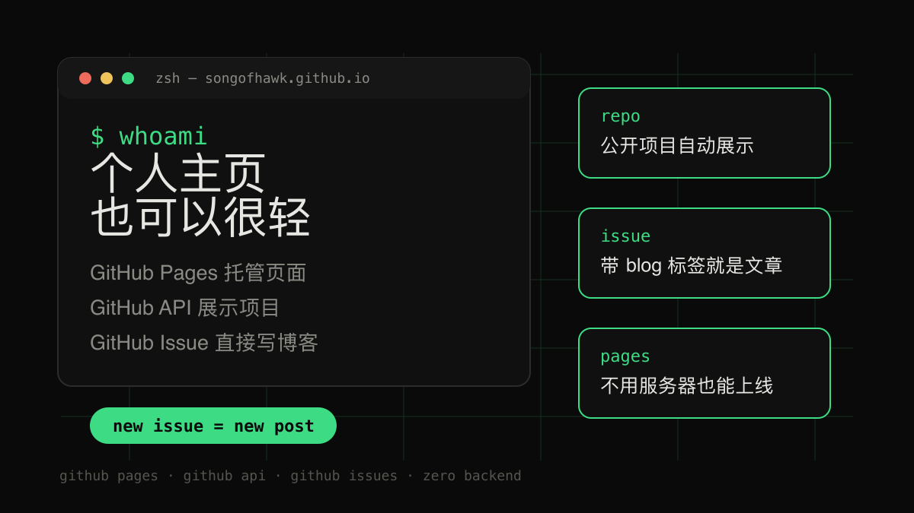
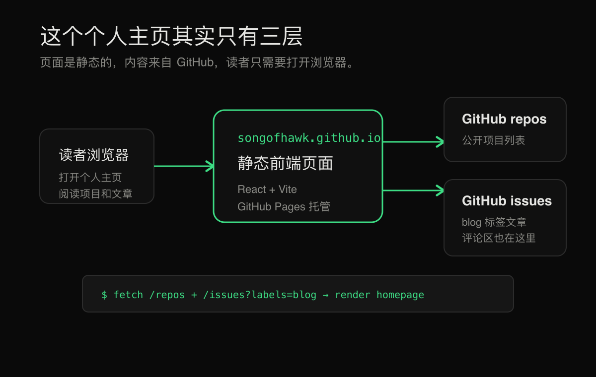
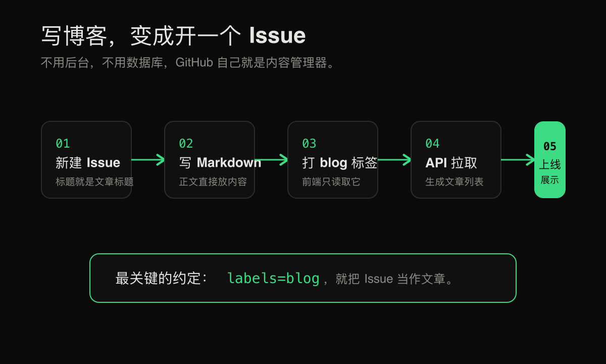

# 我用 GitHub 搭了个个人主页：不用服务器，连博客都用 Issue 写

如果你是程序员，或者只是喜欢折腾互联网工具，大概率都会想过一件事：

我能不能有一个真正属于自己的个人主页？

不是那种模板感很重的简历页面，也不是每年都要续费、还要操心服务器的博客系统，而是一个打开之后就能看出个人气质的地方：有项目，有文章，有一点技术味，也有一点自己的表达。

这件事其实不用想得太复杂。GitHub 就够了。

我最近做的这个个人主页，就是一个很好的例子：页面托管在 GitHub Pages 上，项目列表来自 GitHub 仓库，博客文章直接来自 GitHub Issue。换句话说，它没有单独的后台，没有数据库，也不需要一台服务器。

写文章，就是开一个 Issue。

这听起来有点“程序员式偷懒”，但实际用下来，它反而很自然。

图：这个主页的核心思路很简单，页面放在 GitHub Pages，项目来自 GitHub 仓库，文章来自 GitHub Issue。

## 个人主页，不一定要做成在线简历

很多人一想到个人主页，就会想到几个固定模块：

- 我是谁
- 我的技能
- 我的项目
- 联系方式
- 工作经历

这当然没错，但也容易做成“网页版简历”。如果你的目标只是找工作，这样足够；但如果你想展示一个长期存在的个人空间，它可以更有个性一点。

比如这个项目的首页，就用了一个接近终端的视觉风格。

打开页面时，你会看到类似命令行的提示符、黑色背景、绿色高亮、`whoami` 这样的输入动画。它传达的不是“我会哪些技术栈”，而是一种更直接的信号：这是一个长期写代码、喜欢工程感和极客风格的人。

这就是个人主页和简历页的区别。

简历页强调“我有什么能力”；个人主页强调“我是谁，我在做什么，我持续产出什么”。

## 为什么 GitHub 很适合做个人主页

GitHub 有三个天然优势。

第一，它可以托管静态网站。

GitHub Pages 可以把一个仓库发布成网页。你把前端代码放进去，构建之后，访问 `https://用户名.github.io` 就能看到页面。对于个人主页来说，这已经足够了。

第二，它本来就是程序员的作品集。

你在 GitHub 上写过什么项目、维护过什么仓库、最近在折腾什么，都是公开可读的数据。与其手动维护一份“项目列表”，不如直接从 GitHub API 读取自己的公开仓库。

这个项目就是这么做的：首页的项目区会请求 GitHub 用户的仓库列表，再过滤掉 fork 出来的项目，展示自己创建的公开项目。这样有一个好处：只要 GitHub 上有新项目，主页就能跟着更新。

第三，Issue 本身就是一个轻量内容系统。

Issue 有标题，有正文，有标签，有创建时间，还有评论区。它已经具备一篇博客文章需要的大部分元素。

如果我们约定：所有带有 `blog` 标签的 Issue 都是博客文章，那么一个博客系统就出现了。

## 用 Issue 写博客，思路其实很简单

传统博客系统通常需要这些东西：

- 文章存储
- 文章列表
- 文章详情页
- 标签
- 评论
- 后台编辑器

如果用 GitHub Issue 来做，这些东西几乎都能现成拿到。

文章存储在哪里？

在 Issue 里。

文章列表怎么来？

调用 GitHub API，读取某个仓库下带 `blog` 标签的 Issue。

文章详情页怎么来？

点击某篇文章时，根据 Issue 编号找到对应内容，再用 Markdown 渲染出来。

标签怎么来？

Issue labels 就是标签。

评论怎么来？

Issue 自带评论区。

后台编辑器呢？

GitHub 的 Issue 编辑框就是后台。

所以整个系统并没有“发明”一套新东西，而是把 GitHub 已经有的能力重新组合了一下。

这也是我觉得它有意思的地方：它不是复杂架构，而是把现成工具用顺了。

## 本项目是怎么做的

这个主页用的是 React 和 Vite，页面本身是一个静态前端应用。它大概分成三块：

图：读者访问的是静态页面，页面再从 GitHub API 读取公开项目和带 `blog` 标签的 Issue。

第一块是首页。

首页负责展示个人介绍、精选应用、GitHub 项目和文章列表。视觉上走的是极简终端风格：黑色背景、绿色点缀、等宽字体、命令行提示符。这种风格不需要太多装饰，但很容易形成记忆点。

第二块是项目展示。

项目列表不是手写在页面里的，而是从 GitHub API 获取。代码会读取 `songofhawk` 这个用户的公开仓库，然后按更新时间排序，把非 fork 的项目展示出来。

这就避免了一个常见问题：主页做好之后很快忘了维护。

只要 GitHub 仓库还在更新，主页就不会完全变成一张静态名片。

第三块是博客系统。

博客文章来自这个仓库的 Issue。规则很简单：

1. 在仓库里新建一个 Issue。
2. Issue 标题就是文章标题。
3. Issue 正文就是文章内容，支持 Markdown。
4. 给 Issue 打上 `blog` 标签。
5. 主页自动把它显示在 writing 区域。

图：这套博客系统最关键的约定就是 `labels=blog`。只要 Issue 有这个标签，前端就把它当文章展示。

文章详情页也不需要后端路由，而是用了 GitHub Pages 更友好的 hash 路由。比如 `#/blog/42` 就代表第 42 号 Issue 对应的文章。这样即使部署在 GitHub Pages 上，也不容易遇到刷新后 404 的问题。

## 这样做有什么好处

最大的好处是省心。

不需要买服务器，不需要维护数据库，不需要搭建后台，不需要考虑评论系统怎么做。GitHub 已经帮你解决了很多基础问题。

第二个好处是写作门槛低。

你想发文章时，只要打开 GitHub，新建一个 Issue，把内容写进去，再打上 `blog` 标签就行。文章写错了，编辑 Issue；想隐藏文章，去掉标签或者关闭 Issue。

第三个好处是内容和项目天然放在一起。

很多技术文章本来就和项目有关。把文章写在同一个仓库的 Issue 里，读者可以从文章跳到项目，也可以从项目看到文章。对于个人品牌来说，这比单独开一个孤立博客更连贯。

第四个好处是评论很自然。

普通博客要接评论系统，经常会遇到登录、垃圾评论、样式适配等问题。Issue 评论虽然不适合所有读者，但对技术内容来说非常合适。读者如果本来就有 GitHub 账号，可以直接在 Issue 下讨论。

## 当然，它也有局限

这个方案不是万能的。

首先，它更适合技术读者。如果你的读者完全不用 GitHub，那么 Issue 评论区对他们就不够友好。

其次，GitHub API 有访问限制。如果访问量很大，或者用户短时间内请求很多次，可能会遇到速率限制。这个项目里做了简单缓存，减少重复请求，但它仍然不是一个高并发内容平台。

再次，Issue 写作虽然方便，但它不是专业 CMS。复杂排版、权限管理、多作者协作、草稿审核这些能力，都不是它的重点。

但对个人主页和轻量博客来说，这些局限通常可以接受。

因为我们的目标不是做一个“大而全的内容平台”，而是做一个稳定、轻量、有个人风格的长期主页。

## 如果你也想搭一个，可以按这个顺序来

第一步，创建一个 GitHub Pages 仓库。

如果你希望主页地址是 `https://你的用户名.github.io`，仓库名通常就用 `你的用户名.github.io`。

第二步，做一个静态前端页面。

可以用 React、Vue、Astro，也可以直接写 HTML/CSS。技术选型不重要，重要的是页面要能表达你自己。极客风格不等于堆满动画和代码雨，克制一点反而更有质感。

第三步，接入 GitHub 项目列表。

调用 GitHub API 读取你的公开仓库，把你想展示的项目列出来。可以按更新时间排序，也可以只展示精选项目。

第四步，把 Issue 当成博客数据源。

约定一个标签，比如 `blog`。前端只读取带这个标签的 Issue，并把 Issue 标题、正文、创建时间、标签和评论数渲染出来。

第五步，设计文章详情页。

Issue 正文通常是 Markdown，所以前端需要把 Markdown 转成 HTML。为了安全，最好再做一次 HTML 清理，避免直接渲染不可信内容。

第六步，部署到 GitHub Pages。

部署完成后，你就得到一个不需要服务器的个人主页。以后写文章，只需要发 Issue；以后做新项目，只需要推到 GitHub。

## 极客风格的核心，不是黑底绿字

很多人理解的极客风格，是黑色背景、命令行、等宽字体、绿色光标。

这些当然是很典型的视觉元素，但它们只是表面。

真正的极客风格，是用尽量简单、可控、可长期维护的方式，把工具组合成自己的系统。

这个主页最有意思的地方也在这里：

GitHub Pages 负责托管。

GitHub API 负责数据。

GitHub Issues 负责文章。

GitHub labels 负责分类。

GitHub comments 负责讨论。

前端只负责把这些东西组织成一个好看的入口。

这套方案并不炫技，但很实用。它让个人主页从一个“做完就不动的作品展示页”，变成一个可以持续更新的小系统。

对我来说，这就是一个好个人主页应该有的样子：

能展示作品，也能承载写作。

能表达审美，也能保持简单。

能长期存在，也不用经常维护。

如果你也想拥有一个属于自己的网上空间，不一定要从买服务器、装博客系统、调数据库开始。

你可以先从一个 GitHub 仓库开始。

再开一个 Issue，写下第一篇文章。

这就够了。
